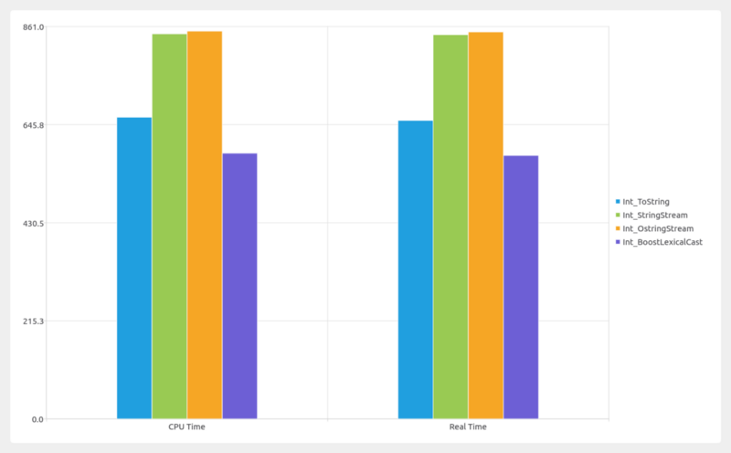
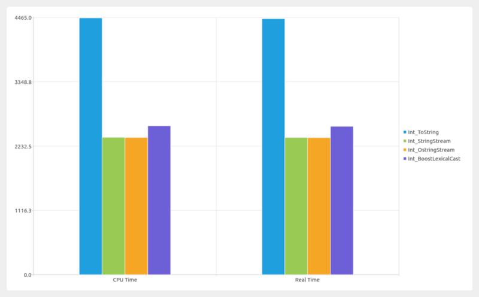

# string conversion benchmark in C++

There are three ways to convert any fundamental data to string.

* std::to_string
* std::ostringstream
* boost::lexical_cast

```cpp
template <typename T>
std::string stringify_ostringstream(T val)
{
    std::ostringstream ss;
    ss << val;
    return ss.str();
}
```

```cpp
std::ostringstream g_buffer;

template <typename T>
std::string stringify_ostringstream_reuse(T val)
{
    g_buffer.str(""); 
    g_buffer.clear();
    g_buffer << val;
    return g_buffer.str();
}
```

```cpp
template <typename T>
std::string stringify_tostring(T val)
{
    return std::to_string(val);
}
```

In this post, I will analyze which one is the fastest to convert any fundamental(int, double, boolean) data to string. I am using google benchmark to measure the time difference. In all charts, y-axis is time in nano seconds.

### type=int input_count = 1



For only, one conversion, both std::stringstream and std::ostringstream take nearly same time. boost::lexical_cast in the fastest. And std::to_string is faster than stringstream and slower than boost::lexical_cast. boost::lexical_cast is not the best way for string conversion, because it throws an exception in case of failure.

### type=int input_count > 30



Here both std::stringstream and std::ostringstream outperform std::to_string and boost::lexical_cast. You can get better result by reusing std::stringstream and std::ostringstream buffer.

```cpp
std::ostringstream oss;
oss.str(“”);
oss.clear();
```

Creating stream objects are very expensive. So, reuse of buffer gives better result.


### type=double input_count=1


Performance is very similar to integer. Boost lexical_cast outperforms std::to_string and stringstream.

### type=double input_count=30


For multiple inputs, boost::lexical_cast outperforms everyone else.

So, my observations are

* Always use std::to_string to convert any single value to std::string.
* In case of double, use std::string. If you need, precision, use std::ostringstream.
* In all other cases, use std::ostringstream.

Image produced: [https://github.com/asit-dhal/BenchmarkViewer](https://github.com/asit-dhal/BenchmarkViewer)
