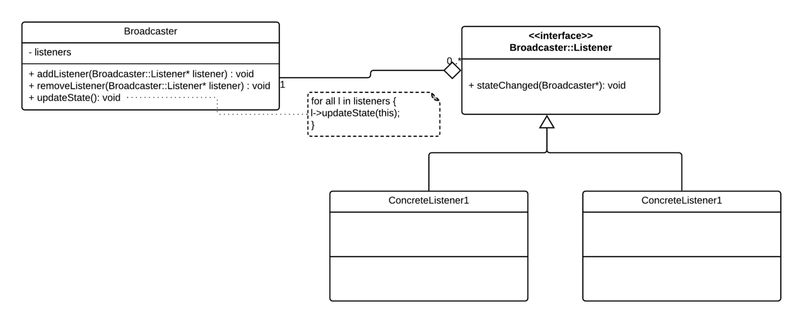
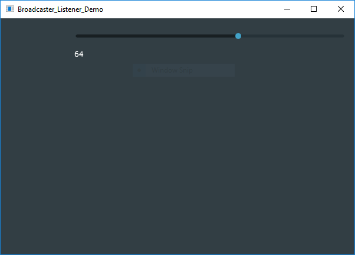
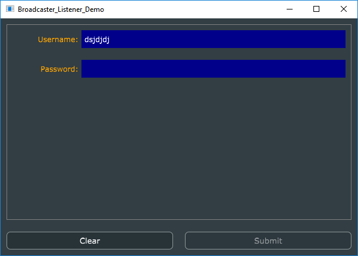

## Broadcasters and listeners in JUCE


Juce uses broadcasters and listeners pattern to propagate state changes. This is like classical observer pattern. Broadcasters are subjects and listeners are observers. Juce Framework provides predefined library to automate this process.

Let’s say we have a Window with a slider and a label. When the user changes the slider position, the label will show the value.

```cpp
// MainComponent.h
#pragma once

#include "../JuceLibraryCode/JuceHeader.h"

class MainComponent   : public Component
{
public:
    MainComponent();
    ~MainComponent();

    void paint (Graphics&) override;
    void resized() override;

private:
    Slider m_valueSlider;
    Label m_sliderLabel;

    JUCE_DECLARE_NON_COPYABLE_WITH_LEAK_DETECTOR (MainComponent)
};
```

```cpp
// MainComponent.cpp

#include "MainComponent.h"

MainComponent::MainComponent()
{
    addAndMakeVisible(m_valueSlider);
    m_valueSlider.setRange(10, 100); 
    m_valueSlider.setTextValueSuffix(" Cnt");
    m_valueSlider.setTextBoxStyle(Slider::TextEntryBoxPosition::NoTextBox, false, 0, 0);

    addAndMakeVisible(m_sliderLabel);
    m_sliderLabel.setText("Value", dontSendNotification);
    setSize (600, 400);
}

MainComponent::~MainComponent()
{
}

void MainComponent::paint (Graphics& g)
{
    g.fillAll (getLookAndFeel().findColour (ResizableWindow::backgroundColourId));

    g.setFont (Font (16.0f));
    g.setColour (Colours::white);
}

void MainComponent::resized()
{
    auto sliderLeft = 120;
    m_valueSlider.setBounds(sliderLeft, 20, getWidth() - sliderLeft - 10, 20);
    m_sliderLabel.setBounds(sliderLeft, 50, getWidth() - sliderLeft - 10, 20);
}
```

At this moment both the slider and the label don’t interact with each other.

We are going to show the value of slider in the label.

### Listeners

Most Juce components have an inner class called Listener.

- This class is an abstract class with at least one pure virtual function. An observer has to inherit from this abstract class and implement the pure virtual function(s). This pure virtual function is the callback.

- one member function called void addListener(Listener* listener). Using this function, an observer can register it self.

- another member function called void removeListener(Listener* listener). This one removes the previously registered listener.

- Whenever a listener is registered, the address is stored in a ListenerList container.

- Whenever the state changes, the broadcaster iterates over all the registered listeners and calls the appropriate callback.




Slider::Listener provides ```Slider::Listener::sliderValueChanged( Slider *slide)```. We can override that function in the MainComponent. Then register the main component as a listener. In the implementation of sliderValueChanged, we can set the value of the slider in the label.

```cpp
//MainComponent.h 
#pragma once

#include "../JuceLibraryCode/JuceHeader.h"

class MainComponent   : public Component,
    public Slider::Listener // step 1: inherit the listener abstract class
{
public:
    MainComponent();
    ~MainComponent();

    void paint (Graphics&) override;
    void resized() override;
    
    // step 2: implementation of pure virtual function 
    void sliderValueChanged(Slider *slider) override;

private:
    Slider m_valueSlider;
    Label m_sliderLabel;

    JUCE_DECLARE_NON_COPYABLE_WITH_LEAK_DETECTOR (MainComponent)
};
```

```cpp
//MainComponent.cpp
#include "MainComponent.h"

MainComponent::MainComponent()
{
    addAndMakeVisible(m_valueSlider);
    m_valueSlider.setRange(10, 100); 
    m_valueSlider.setTextValueSuffix(" Cnt");
    m_valueSlider.setTextBoxStyle(Slider::TextEntryBoxPosition::NoTextBox, false, 0, 0);

    addAndMakeVisible(m_sliderLabel);
    m_sliderLabel.setText("Value", dontSendNotification);
    setSize (600, 400);

    // step 3: register the listener
    m_valueSlider.addListener(this);
}

MainComponent::~MainComponent()
{
    // step 5: unregister the listener
    m_valueSlider.removeListener(this);
}

void MainComponent::paint (Graphics& g)
{
    g.fillAll (getLookAndFeel().findColour (ResizableWindow::backgroundColourId));

    g.setFont (Font (16.0f));
    g.setColour (Colours::white);
}

void MainComponent::resized()
{
    auto sliderLeft = 120;
    m_valueSlider.setBounds(sliderLeft, 20, getWidth() - sliderLeft - 10, 20);
    m_sliderLabel.setBounds(sliderLeft, 50, getWidth() - sliderLeft - 10, 20);
}

void MainComponent::sliderValueChanged(Slider *slider)
{
    // step 4: when the value changes, do whatever you want to do.
    if (&m_valueSlider == slider) {
        auto value = slider->getValue();
        m_sliderLabel.setText(String(std::to_string(static_cast<int>(value))), dontSendNotification);
    }
}
```


The broadcaster and listener can have a many to many relationship. One callback can be invoked by many broadcaster. So, you need to know which instanced invoked it. So we do the address comparison in line 44(In this case, it’s not necessary, because we have only one broadcaster.).



### User provided Listener

You can also provide your own Listener interface.

Let’s say you have a login form. It has two input boxes, one submit button and one clear button. Clear button is activated when at least one input box has some text and Submit button is activated if both are filled with some data.

We separate the username and password input control to a separate component, called InputForm. In the main component, we have the InputForm and bothe the buttons.

```cpp
// InputForm.h

#pragma once

#include "../JuceLibraryCode/JuceHeader.h"

class InputForm  : public Component
{
public:
    InputForm();
    ~InputForm();

    
    void paint (Graphics&) override;
    void resized() override;
    void submit();
    void clear();

private:
    Label m_usernameLabel;
    Label m_passwordLabel;
    Label m_usernameInput;
    Label m_passwordInput;

    JUCE_DECLARE_NON_COPYABLE_WITH_LEAK_DETECTOR (InputForm)
};
```

```cpp
// InputForm.cpp

#include "../JuceLibraryCode/JuceHeader.h"
#include "InputForm.h"

InputForm::InputForm()
{
    addAndMakeVisible(m_usernameLabel);
    m_usernameLabel.setText("Username:", dontSendNotification);
    m_usernameLabel.attachToComponent(&m_usernameInput, true);
    m_usernameLabel.setColour(Label::textColourId, Colours::orange);
    m_usernameLabel.setJustificationType(Justification::right);

    addAndMakeVisible(m_passwordLabel);
    m_passwordLabel.setText("Password:", dontSendNotification);
    m_passwordLabel.attachToComponent(&m_passwordInput, true);
    m_passwordLabel.setColour(Label::textColourId, Colours::orange);
    m_passwordLabel.setJustificationType(Justification::right);

    addAndMakeVisible(m_usernameInput);
    m_usernameInput.setEditable(true);
    m_usernameInput.setColour(Label::backgroundColourId, Colours::darkblue);
    m_usernameInput.setJustificationType(Justification::left);

    addAndMakeVisible(m_passwordInput);
    m_passwordInput.setEditable(true);
    m_passwordInput.setColour(Label::backgroundColourId, Colours::darkblue);
    m_passwordInput.setJustificationType(Justification::left);
}

InputForm::~InputForm()
{
}

void InputForm::paint (Graphics& g)
{

    g.fillAll (getLookAndFeel().findColour (ResizableWindow::backgroundColourId));   // clear the background

    g.setColour (Colours::grey);
    g.drawRect (getLocalBounds(), 1);

}

void InputForm::resized()
{
    auto marginX = 10;
    auto marginY = 10;
    auto localBounds = getLocalBounds();

    auto usernameRect = localBounds.removeFromTop(50);
    m_usernameLabel.setBounds(usernameRect.removeFromLeft(usernameRect.getWidth() / 5).reduced(marginX, marginY));
    m_usernameInput.setBounds(usernameRect.reduced(marginX, marginY));

    auto passwordRect = localBounds.removeFromTop(50);
    m_passwordLabel.setBounds(passwordRect.removeFromLeft(passwordRect.getWidth() / 5).reduced(marginX));
    m_passwordInput.setBounds(passwordRect.reduced(marginX, marginY));
}
```

```cpp
// MainComponent.h

#pragma once

#include "../JuceLibraryCode/JuceHeader.h"
#include "InputForm.h"

class MainComponent   : public Component
{
public:
    MainComponent();
    ~MainComponent();

    void paint (Graphics&) override;
    void resized() override;

private:
    InputForm m_inputForm;
    TextButton m_clearButton;
    TextButton m_submitButton;
    JUCE_DECLARE_NON_COPYABLE_WITH_LEAK_DETECTOR (MainComponent)
};
```

```cpp
// MainComponent.cpp

#include "MainComponent.h"

MainComponent::MainComponent()
{
    addAndMakeVisible(m_inputForm);
    addAndMakeVisible(m_clearButton);
    addAndMakeVisible(m_submitButton);

    m_clearButton.setButtonText("Clear");
    m_submitButton.setButtonText("Submit");

    setSize (600, 400);
}

MainComponent::~MainComponent()
{
}

void MainComponent::paint (Graphics& g)
{
    g.fillAll (getLookAndFeel().findColour (ResizableWindow::backgroundColourId));

    g.setFont (Font (16.0f));
    g.setColour (Colours::white);
}

void MainComponent::resized()
{
    auto localBounds = getLocalBounds();
    auto buttonArea = localBounds.removeFromBottom(50);

    m_clearButton.setBounds(buttonArea.removeFromLeft(buttonArea.getWidth() / 2).reduced(10));
    m_submitButton.setBounds(buttonArea.reduced(10));

    m_inputForm.setBounds(localBounds.reduced(10, 10));
}
```

We can add a listener interface to the InputForm. It will have to callbacks

- ```clearActivated()```
- ```submitActivated()```

InputForm must maintain a list of interested listeners and should provide api call for registration and de-registration.


```cpp
// InputForm.h

#pragma once

#include "../JuceLibraryCode/JuceHeader.h"

class InputForm  : public Component
{
public:
    // other code
    class Listener
    {
    public:
        virtual ~Listener() = default;
        virtual void clearActivated(InputForm*, bool isActive) = 0;
        virtual void submitActivated(InputForm*, bool isActive) = 0;
    };

    void addListener(Listener* listenerToAdd);
    void removeListener(Listener* listenerToRemove);

    // ...
private:
    void clearActivate(bool isActive);
    void submitActivate(bool isActive);

    // ...
    bool m_clearActive;
    bool m_submitActive;
    ListenerList<Listener> m_listeners;
    // ....
};
```

```cpp
// InputForm.cpp

InputForm::InputForm()
{
    // ...
    m_clearActive = false;
    m_submitActive = false;
}

void InputForm::addListener(Listener* listenerToAdd)
{
    m_listeners.add(listenerToAdd);
}

void InputForm::removeListener(Listener* listenerToRemove)
{
    jassert(m_listeners.contains(listenerToRemove));
    m_listeners.remove(listenerToRemove);
}

void InputForm::clearActivate(bool isActive)
{
    m_listeners.call([this, isActive](Listener& l) { l.clearActivated(this, isActive); });
}

void InputForm::submitActivate(bool isActive)
{
    m_listeners.call([this, isActive](Listener& l) { l.submitActivated(this, isActive); });
}

```


Juce ListenerList<T> class should be used to store the list of listeners. It has many advantages than the std lists, like

1. add or remove listeners from the list during one of the callbacks — i.e. while it’s in the middle of iterating the listeners, then it’s guaranteed that no listeners will be mistakenly called after they’ve been removed, but it may mean that some of the listeners could be called more than once, or not at all, depending on the list’s order.

2. It has a bailout checker(Component::BailOutChecker class) which checks if the component has already been deleted. This provides safety guarantee that no callback will be called on a deleted component.

3. ListenerList checks if the listener is already in the list or not. So, double addition won’t have any effect.

Now, after implementing input and clear logic, the InputForm control looks like this.

```cpp
// InputForm.h

#pragma once

#include "../JuceLibraryCode/JuceHeader.h"

class InputForm  : public Component,
    public Label::Listener
{
public:
    InputForm();
    ~InputForm();

    class Listener
    {
    public:
        virtual ~Listener() = default;
        virtual void clearActivated(InputForm*, bool isActive) = 0;
        virtual void submitActivated(InputForm*, bool isActive) = 0;
    };

    void addListener(Listener* listenerToAdd);
    void removeListener(Listener* listenerToRemove);

    void paint (Graphics&) override;
    void resized() override;
    
    void labelTextChanged(Label *labelThatHasChanged) override;
    
    void submit();
    void clear();

private:
    void clearActivate(bool isActive);
    void submitActivate(bool isActive);

    Label m_usernameLabel;
    Label m_passwordLabel;
    Label m_usernameInput;
    Label m_passwordInput;

    bool m_clearActive;
    bool m_submitActive;
    ListenerList<Listener> m_listeners;

    JUCE_DECLARE_NON_COPYABLE_WITH_LEAK_DETECTOR (InputForm)
};
```

```cpp
// InputForm.cpp

#include "../JuceLibraryCode/JuceHeader.h"
#include "InputForm.h"

InputForm::InputForm()
{
    addAndMakeVisible(m_usernameLabel);
    m_usernameLabel.setText("Username:", dontSendNotification);
    m_usernameLabel.attachToComponent(&m_usernameInput, true);
    m_usernameLabel.setColour(Label::textColourId, Colours::orange);
    m_usernameLabel.setJustificationType(Justification::right);

    addAndMakeVisible(m_passwordLabel);
    m_passwordLabel.setText("Password:", dontSendNotification);
    m_passwordLabel.attachToComponent(&m_passwordInput, true);
    m_passwordLabel.setColour(Label::textColourId, Colours::orange);
    m_passwordLabel.setJustificationType(Justification::right);

    addAndMakeVisible(m_usernameInput);
    m_usernameInput.setEditable(true);
    m_usernameInput.setColour(Label::backgroundColourId, Colours::darkblue);
    m_usernameInput.setJustificationType(Justification::left);

    addAndMakeVisible(m_passwordInput);
    m_passwordInput.setEditable(true);
    m_passwordInput.setColour(Label::backgroundColourId, Colours::darkblue);
    m_passwordInput.setJustificationType(Justification::left);

    m_clearActive = false;
    m_submitActive = false;

    m_usernameInput.addListener(this);
    m_passwordInput.addListener(this);
}

InputForm::~InputForm()
{
    m_usernameInput.removeListener(this);
    m_passwordInput.removeListener(this);
}

void InputForm::paint (Graphics& g)
{

    g.fillAll (getLookAndFeel().findColour (ResizableWindow::backgroundColourId));   // clear the background

    g.setColour (Colours::grey);
    g.drawRect (getLocalBounds(), 1);

}

void InputForm::resized()
{
    auto marginX = 10;
    auto marginY = 10;
    auto localBounds = getLocalBounds();

    auto usernameRect = localBounds.removeFromTop(50);
    m_usernameLabel.setBounds(usernameRect.removeFromLeft(usernameRect.getWidth() / 5).reduced(marginX, marginY));
    m_usernameInput.setBounds(usernameRect.reduced(marginX, marginY));

    auto passwordRect = localBounds.removeFromTop(50);
    m_passwordLabel.setBounds(passwordRect.removeFromLeft(passwordRect.getWidth() / 5).reduced(marginX));
    m_passwordInput.setBounds(passwordRect.reduced(marginX, marginY));
}


void InputForm::addListener(Listener* listenerToAdd)
{
    m_listeners.add(listenerToAdd);
}

void InputForm::removeListener(Listener* listenerToRemove)
{
    jassert(m_listeners.contains(listenerToRemove));
    m_listeners.remove(listenerToRemove);
}

void InputForm::clearActivate(bool isActive)
{
    m_listeners.call([this, isActive](Listener& l) { l.clearActivated(this, isActive); });
}

void InputForm::submitActivate(bool isActive)
{
    m_listeners.call([this, isActive](Listener& l) { l.submitActivated(this, isActive); });
}

void InputForm::labelTextChanged(Label *labelThatHasChanged)
{
    bool atLeastOneTextFilled = false;

    if (labelThatHasChanged == &m_usernameInput) {
        atLeastOneTextFilled = !m_usernameInput.getText(false).isEmpty();
    }
    else if (labelThatHasChanged == &m_passwordInput) {
        atLeastOneTextFilled = !m_passwordInput.getText(false).isEmpty();
    }

    if (!m_clearActive && atLeastOneTextFilled) {
        m_clearActive = true;
        clearActivate(true);
    }
    else if (m_clearActive && !atLeastOneTextFilled) {
        m_clearActive = false;
        clearActivate(false);
    }

    bool allTextFilled = !m_usernameInput.getText(true).isEmpty() && !m_passwordInput.getText(true).isEmpty();
    if (!m_submitActive && allTextFilled) {
        m_submitActive = true;
        submitActivate(true);
    }
    else if (m_submitActive && !allTextFilled) {
        m_submitActive = false;
        submitActivate(false);
    }
}

void InputForm::submit()
{
    // do nothing
}
void InputForm::clear()
{
    m_usernameInput.setText("", NotificationType::sendNotification);
    m_passwordInput.setText("", NotificationType::sendNotification);
}
```

When you clear the label programmatically, you need to set the NotificationType. In this case, once the input texts are cleared, we need the callbacks to be called to set the submit and active status. So, we use NotificationType as sendNotification.

In the main component, we implement the InputForm::Listener interface and accordingly set the enabled/disabled status of the buttons.

```cpp
// MainComponent.h

#pragma once

#include "../JuceLibraryCode/JuceHeader.h"
#include "InputForm.h"

class MainComponent   : public Component,
    public InputForm::Listener
{
public:
    MainComponent();
    ~MainComponent();

    void paint (Graphics&) override;
    void resized() override;

    void clearActivated(InputForm*, bool isActive) override;
    void submitActivated(InputForm*, bool isActive) override;

private:
    InputForm m_inputForm;
    TextButton m_clearButton;
    TextButton m_submitButton;
    JUCE_DECLARE_NON_COPYABLE_WITH_LEAK_DETECTOR (MainComponent)
};





// MainComponent.cpp

#include "MainComponent.h"

MainComponent::MainComponent()
{
    addAndMakeVisible(m_inputForm);
    addAndMakeVisible(m_clearButton);
    addAndMakeVisible(m_submitButton);

    m_clearButton.setButtonText("Clear");
    m_submitButton.setButtonText("Submit");
    m_clearButton.setEnabled(false);
    m_submitButton.setEnabled(false);

    m_inputForm.addListener(this);

    m_clearButton.onClick = [this] {m_inputForm.clear(); };
    m_submitButton.onClick = [this] {m_inputForm.submit(); };

    setSize (600, 400);
}

MainComponent::~MainComponent()
{
    m_inputForm.removeListener(this);
}

void MainComponent::paint (Graphics& g)
{
    g.fillAll (getLookAndFeel().findColour (ResizableWindow::backgroundColourId));

    g.setFont (Font (16.0f));
    g.setColour (Colours::white);
}

void MainComponent::resized()
{
    auto localBounds = getLocalBounds();
    auto buttonArea = localBounds.removeFromBottom(50);

    m_clearButton.setBounds(buttonArea.removeFromLeft(buttonArea.getWidth() / 2).reduced(10));
    m_submitButton.setBounds(buttonArea.reduced(10));

    m_inputForm.setBounds(localBounds.reduced(10, 10));
}

void MainComponent::clearActivated(InputForm*, bool isActive)
{
    m_clearButton.setEnabled(isActive);
}

void MainComponent::submitActivated(InputForm*, bool isActive)
{
    m_submitButton.setEnabled(isActive);
}
```

The application finally looks like this



Comparison with Qt Signal/Slots

1. Callbacks are like Slots in Qt. Qt MOC does all the major work of adding code for callback handling. There is no MOC here, so developer has to write everything.

2. In Qt, signal emitters are completely decoupled from signal receivers. So, if you want to add a new signal, it needs minimum amount of code change. In Juce, you will need at least one pure virtual function, code for listener registration and removal.

3. Both Qt and Juce provide asynchronous call by using Qt Event loop and Juce AsyncUpdater respectively. But Juce needs some protection from race condition.

I wrote this blog to clarify my doubts. Feel free to correct if I am wrong or write a comment if you want to suggest something.

The source code is shared here

[https://github.com/asit-dhal/Broadcaster-Listener-Demo](https://github.com/asit-dhal/Broadcaster-Listener-Demo)
