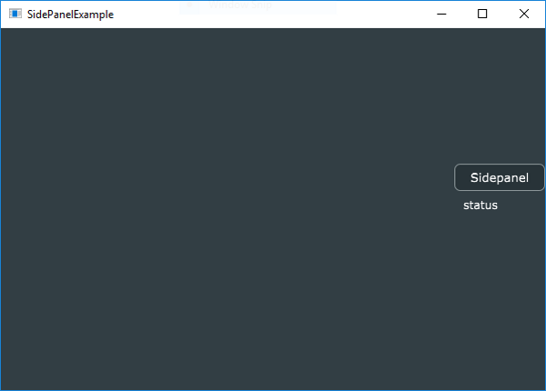
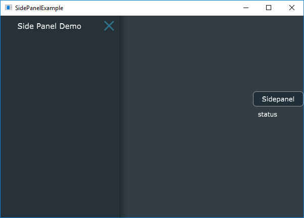
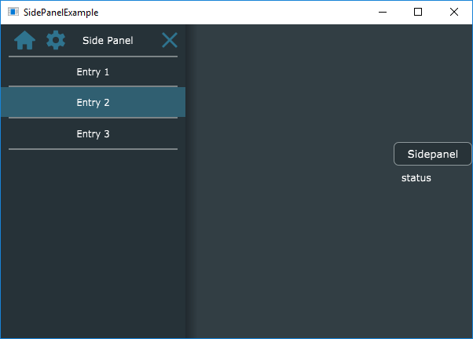

# Side Panel in JUCE

This tutorial explains the side panel in JUCE GUI framework.

Side Panel can be used for navigation if the application doesn’t have a tool bar or menu bar. Usually, it stays on the left or right side of the application and triggered by the user.

Juce has built-in support for side panel.

Let’s first make a skeleton app. The app will have a button to trigger side panel and a label to show the status.

```cpp
// MainComponent.h

#pragma once

#include "../JuceLibraryCode/JuceHeader.h"

class MainComponent   : public Component
{
public:
    MainComponent();
    ~MainComponent();

    void paint (Graphics&) override;
    void resized() override;

private:
    TextButton m_invokeSidePanel;
    Label m_sidePanelStatus;

    JUCE_DECLARE_NON_COPYABLE_WITH_LEAK_DETECTOR (MainComponent)
};
```

```cpp
// MainComponent.cpp

#include "MainComponent.h"

MainComponent::MainComponent(): m_invokeSidePanel("Sidepanel", "Show Sidepanel")
{
    addAndMakeVisible(m_invokeSidePanel);
    addAndMakeVisible(m_sidePanelStatus);

    m_sidePanelStatus.setText("status", dontSendNotification);
    setSize (600, 400);
}

MainComponent::~MainComponent()
{
}

void MainComponent::paint (Graphics& g)
{
    g.fillAll (getLookAndFeel().findColour (ResizableWindow::backgroundColourId));
}

void MainComponent::resized()
{
    auto localBounds = getLocalBounds();
    if (localBounds.getHeight() / 2 - 50 > 5)
        localBounds.removeFromTop(localBounds.getHeight() / 2 - 50);
    if (localBounds.getWidth() / 2 - 50 > 5)
        localBounds.removeFromLeft(localBounds.getWidth() / 2 - 50);

    auto buttonBound = localBounds.removeFromTop(30).removeFromRight(100);
    auto statusLabelBound = localBounds.removeFromTop(30).removeFromRight(100).reduced(5);
    m_invokeSidePanel.setBounds(buttonBound);
    m_sidePanelStatus.setBounds(statusLabelBound);
}
```

When user clicks the button, the side panel should appear. There is already a closed button on the side panel, the user can click on this to close the side panel.

The side panel will have a list of entries. When the user selects any of those entries, the status label should show the text.



Juce provides a built in component called Side Panel, https://docs.juce.com/master/classSidePanel.html

### Sidepanel Components

SidePanel has two parts.

1. header which can contain a label, a few buttons and a close button
2. a list box which shows a list of entries

Let’s add a SidePanel component to the main component. The SidePanel should be shown when the user clicks on the sidePanel button in the main component.

```cpp
// MainComponent.h
#pragma once

#include "../JuceLibraryCode/JuceHeader.h"

class MainComponent   : public Component,
    // step 2: override Button::Listener to get broadcast events from the button
    public Button::Listener
{
public:
    // ...
    // step 3: implement the button clicked callback
    void buttonClicked(Button*) override;

private:
    // ...
    // step 1: add sidepanel
    SidePanel m_sidePanel;
};
```

```cpp
// MainComponent.cpp

#include "MainComponent.h"

MainComponent::MainComponent(): m_invokeSidePanel("Sidepanel", "Show Sidepanel"),
    m_sidePanel("Side Panel Demo", 250, true, nullptr, false)
{
    // ....
    addAndMakeVisible(m_sidePanel);

    // ...
    m_invokeSidePanel.addListener(this);
}

MainComponent::~MainComponent()
{
    m_invokeSidePanel.removeListener(this);
}

void MainComponent::buttonClicked(Button* btn)
{
    if (btn == &m_invokeSidePanel)
    {
        // step 4: show the side panel when the button is clicked
        m_sidePanel.showOrHide(true);
    }
}
```

Now, if you run this, you will a side Panel without any contents on this(there will be only title and a close button).



#### Header Component

Let’s add the header component

The header has two shape buttons(one for home and another for settings), a title and a close button.


```cpp
// SidePanelHeader.h

#include "../JuceLibraryCode/JuceHeader.h"

class SidePanelHeader : public Component
{
public:
    SidePanelHeader(const String& titleText);
    ~SidePanelHeader();

    void paint (Graphics&) override;
    void resized() override;

private:
    Label m_titleLabel;
    ShapeButton m_homeButton{ "Home", Colours::transparentBlack, Colours::transparentBlack, Colours::transparentBlack },
        m_settingsButton{ "Settings", Colours::transparentBlack, Colours::transparentBlack, Colours::transparentBlack };

    JUCE_DECLARE_NON_COPYABLE_WITH_LEAK_DETECTOR (SidePanelHeader)
};
```

ShapeButton has only one constructor, which takes three color ids, normal color(the colour to fill the shape with when the mouse isn’t over), overColor(the colour to use when the mouse is over the shape) and downColour(the colour to use when the button is in the pressed-down state). In the beginning we will make everything transparent black and repaint with proper color in the paint() method.

```cpp
// SidePanelHeader.cpp

#include "../JuceLibraryCode/JuceHeader.h"
#include "SidePanelHeader.h"

SidePanelHeader::SidePanelHeader(const String& titleText)
{
    setOpaque(true);

    static const unsigned char homeIconPathData[]
        = { 110,109,0,0,64,65,0,0,64,64,98,0,0,64,65,0,0,64,64,74,12,186,64,164,112,5,65,24,217,22,64,70,182,
            51,65,98,35,219,9,64,240,167,54,65,0,0,0,64,170,241,58,65,0,0,0,64,0,0,64,65,98,0,0,0,64,22,217,
            72,65,166,155,28,64,0,0,80,65,0,0,64,64,0,0,80,65,108,0,0,160,64,0,0,80,65,108,0,0,160,64,0,0,
            160,65,98,0,0,160,64,139,108,164,65,211,77,174,64,0,0,168,65,0,0,192,64,0,0,168,65,108,0,0,16,65,
            0,0,168,65,98,22,217,24,65,0,0,168,65,0,0,32,65,127,106,164,65,0,0,32,65,0,0,160,65,108,0,0,32,65,0,0,128,
            65,108,0,0,96,65,0,0,128,65,108,0,0,96,65,0,0,160,65,98,0,0,96,65,127,106,164,65,233,38,103,65,0,0,168,
            65,0,0,112,65,0,0,168,65,108,0,0,144,65,0,0,168,65,98,139,108,148,65,0,0,168,65,0,0,152,65,139,108,164,
            65,0,0,152,65,0,0,160,65,108,0,0,152,65,0,0,80,65,108,0,0,168,65,0,0,80,65,98,139,108,172,65,0,0,80,65,0,
            0,176,65,23,217,72,65,0,0,176,65,0,0,64,65,98,0,0,176,65,170,241,58,65,156,196,174,65,240,167,54,65,158,239,
            172,65,70,182,51,65,98,213,120,145,65,164,112,5,65,0,0,64,65,0,0,64,64,0,0,64,65,0,0,64,64,99,
            101,0,0 };

    static const unsigned char settingsIconPathData[]
        = { 110,109,202,111,210,64,243,226,61,64,108,0,0,224,64,0,0,0,0,108,0,0,48,65,0,0,0,0,108,27,200,54,65,243,
            226,61,64,98,91,248,63,65,174,170,76,64,95,130,72,65,231,138,96,64,46,46,80,65,180,163,120,64,108,42,
            181,124,65,20,38,49,64,108,149,90,142,65,246,108,199,64,108,68,249,118,65,2,85,1,65,98,112,166,119,65,
            201,31,6,65,0,0,120,65,111,5,11,65,0,0,120,65,0,0,16,65,98,0,0,120,65,145,250,20,65,108,166,119,65,55,
            224,25,65,72,249,118,65,254,170,30,65,108,151,90,142,65,133,73,60,65,108,46,181,124,65,123,182,115,65,
            108,50,46,80,65,18,215,97,65,98,99,130,72,65,70,221,103,65,96,248,63,65,83,213,108,65,32,200,54,65,66,
            135,112,65,108,0,0,48,65,0,0,144,65,108,0,0,224,64,0,0,144,65,108,202,111,210,64,67,135,112,65,98,74,
            15,192,64,84,213,108,65,65,251,174,64,70,221,103,65,164,163,159,64,19,215,97,65,108,92,43,13,64,123,182,
            115,65,108,187,181,82,62,133,73,60,65,108,244,26,36,64,254,170,30,65,98,64,102,33,64,55,224,25,5,0,0,32,
            64,145,250,20,65,0,0,32,64,0,0,16,65,98,0,0,32,64,111,5,11,65,64,102,33,64,201,31,6,65,244,26,36,64,2,85,
            1,65,108,187,181,82,62,246,108,199,64,108,92,43,13,64,20,38,49,64,108,164,163,159,64,180,163,120,64,98,65,
            251,174,64,231,138,96,64,74,15,192,64,175,170,76,64,202,111,210,64,243,226,61,64,99,109,0,0,16,65,0,0,64,
            65,98,121,130,42,65,0,0,64,65,0,0,64,65,121,130,42,65,0,0,64,65,0,0,16,65,98,0,0,64,65,13,251,234,64,121,
            130,42,65,0,0,192,64,0,0,16,65,0,0,192,64,98,13,251,234,64,0,0,192,64,0,0,192,64,13,251,234,64,0,0,192,64,
            0,0,16,65,98,0,0,192,64,121,130,42,65,13,251,234,64,0,0,64,65,0,0,16,65,0,0,64,65,99,101,0,0 };

    Path p;
    p.loadPathFromData(homeIconPathData, sizeof(homeIconPathData));
    m_homeButton.setShape(p, true, true, false);

    p.clear();
    p.loadPathFromData(settingsIconPathData, sizeof(settingsIconPathData));
    m_settingsButton.setShape(p, true, true, false);

    m_titleLabel.setText(titleText, NotificationType::dontSendNotification);

    addAndMakeVisible(m_titleLabel);
    addAndMakeVisible(m_homeButton);
    addAndMakeVisible(m_settingsButton);
}

SidePanelHeader::~SidePanelHeader()
{
}

void SidePanelHeader::paint (Graphics& g)
{
    g.fillAll (getLookAndFeel().findColour (SidePanel::backgroundColour));   // clear the background

    auto normal = getLookAndFeel().findColour(SidePanel::dismissButtonNormalColour);
    auto over = getLookAndFeel().findColour(SidePanel::dismissButtonOverColour);
    auto down = getLookAndFeel().findColour(SidePanel::dismissButtonDownColour);

    m_homeButton.setColours(normal, over, down);
    m_settingsButton.setColours(normal, over, down);
}

void SidePanelHeader::resized()
{
    auto bounds = getLocalBounds();
    
    bounds.removeFromLeft(10);
    m_homeButton.setBounds(bounds.removeFromLeft(m_homeButton.getWidth()+20).reduced(7));
    m_settingsButton.setBounds(bounds.removeFromLeft(m_settingsButton.getWidth()+20).reduced(7));
    bounds.removeFromLeft(10);

    bounds.removeFromRight(10);
    m_titleLabel.setBounds(bounds);
}
```

I copied the path data for home button and settings button from DemoRunner. This comes with Juce Framework. Everything else is straight forward.

In the MainComponent, we set this header as the title bar component of side panel.

```cpp
// MainComponent.cpp

#include "MainComponent.h"
#include "SidePanelHeader.h"

MainComponent::MainComponent(): m_invokeSidePanel("Sidepanel", "Show Sidepanel"),
    m_sidePanel("", 250, true, nullptr, false) // we don't need the title here anymore
{
    //...
    auto sidePanelHeader = new SidePanelHeader("Side Panel");
    m_sidePanel.setTitleBarComponent(sidePanelHeader, true);
}
```

Notice that the object is dynamically created. After we set, the parent component takes the ownership.

```cpp
void setTitleBarComponent (Component* titleBarComponentToUse,
bool keepDismissButton,
bool deleteComponentWhenNoLongerNeeded = true);
```

The last parameter decides whether the parent component needs to take care of the ownership or not.

Now, let’s add the side panel list. This is just a list box which contains a list and responds to row selection.

```cpp
// SidePanelList.h

#pragma once

#include "../JuceLibraryCode/JuceHeader.h"

class SidePanelList : public Component,
    public ListBoxModel
{
public:
    SidePanelList();
    ~SidePanelList();

    void paint (Graphics&) override;
    void resized() override;
    void paintListBoxItem(int rowNumber, Graphics& g, int width, int height, bool rowIsSelected) override;
    int getNumRows() override;
    void addEntry(const String& entry);
    void selectedRowsChanged(int row) override;

private:
    ListBox m_entries;
    StringArray m_sidePanelEntries;
    JUCE_DECLARE_NON_COPYABLE_WITH_LEAK_DETECTOR (SidePanelList)
};
```

```cpp
// SidePanelList
#include "../JuceLibraryCode/JuceHeader.h"
#include "SidePanelList.h"

SidePanelList::SidePanelList()
{
    setOpaque(true);
    addAndMakeVisible(m_entries);
    m_entries.setModel(this);
    m_entries.setRowHeight(40);
}

SidePanelList::~SidePanelList()
{
}

void SidePanelList::paint (Graphics& g)
{
    g.fillAll (getLookAndFeel().findColour (SidePanel::backgroundColour));   // clear the background

}

void SidePanelList::resized()
{
    m_entries.setBounds(getLocalBounds());
}

void SidePanelList::paintListBoxItem(int rowNumber, Graphics& g, int width, int height, bool rowIsSelected)
{
    if (rowNumber < 0 || rowNumber >= getNumRows())
        return;

    Rectangle<int> bounds(0, 0, width, height);
    auto textColour = findColour(Label::textColourId);
    g.setColour(textColour.withAlpha(0.4f));

    if (rowNumber == 0)
        g.fillRect(bounds.removeFromTop(2).reduced(10, 0));

    g.fillRect(bounds.removeFromBottom(2).reduced(10, 0));

    if (rowIsSelected)
    {
        g.setColour(findColour(TextEditor::highlightColourId).withAlpha(0.4f));
        g.fillRect(bounds);
        textColour = findColour(TextEditor::highlightedTextColourId);
    }

    g.setColour(textColour);
    g.drawFittedText(m_sidePanelEntries[rowNumber], bounds, Justification::centred, 1);
}

void SidePanelList::addEntry(const String& entry)
{
    m_entries.deselectAllRows();
    m_sidePanelEntries.add(entry);
    m_entries.updateContent();
}

int SidePanelList::getNumRows()
{
    return m_sidePanelEntries.size();
}

void SidePanelList::selectedRowsChanged(int row)
{
    if (row < 0)
        return;
}
```

We can integrate this list component with the side panel.

```cpp
// MainComponent.cpp

MainComponent::MainComponent()
{
    //.....
    auto sidePanelList = new SidePanelList;
    sidePanelList->addEntry("Entry 1");
    sidePanelList->addEntry("Entry 2");
    sidePanelList->addEntry("Entry 3");
    m_sidePanel.setContent(sidePanelList);
}
```

The ```setContent``` is like ```setTitleBarComponent```, it takes the ownership.



After attaching all click listeners, we can update the status.

The source code is shared in the github.

[https://github.com/asit-dhal/Juce-SidePanel-Example](https://github.com/asit-dhal/Juce-SidePanel-Example)
